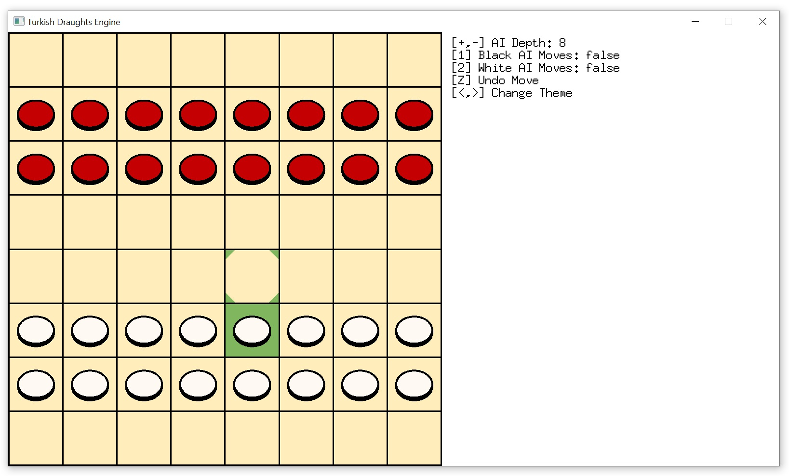
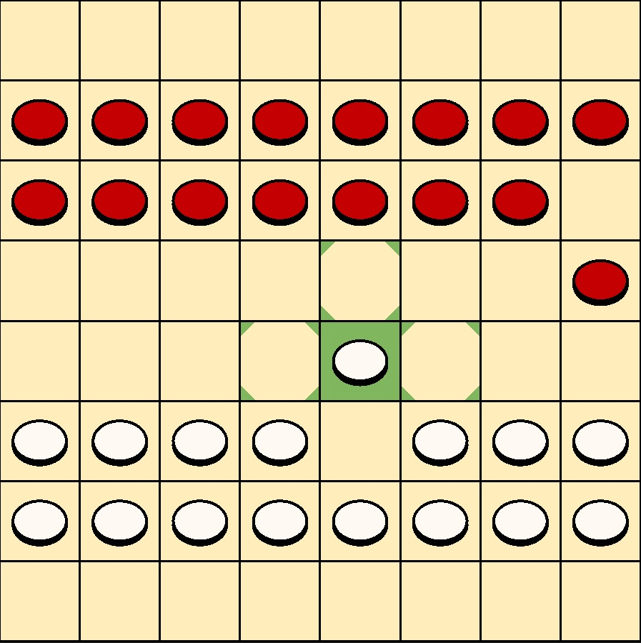
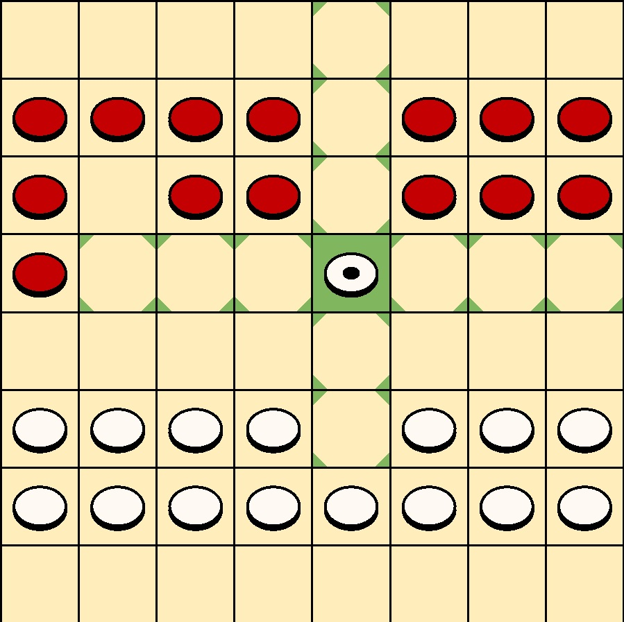
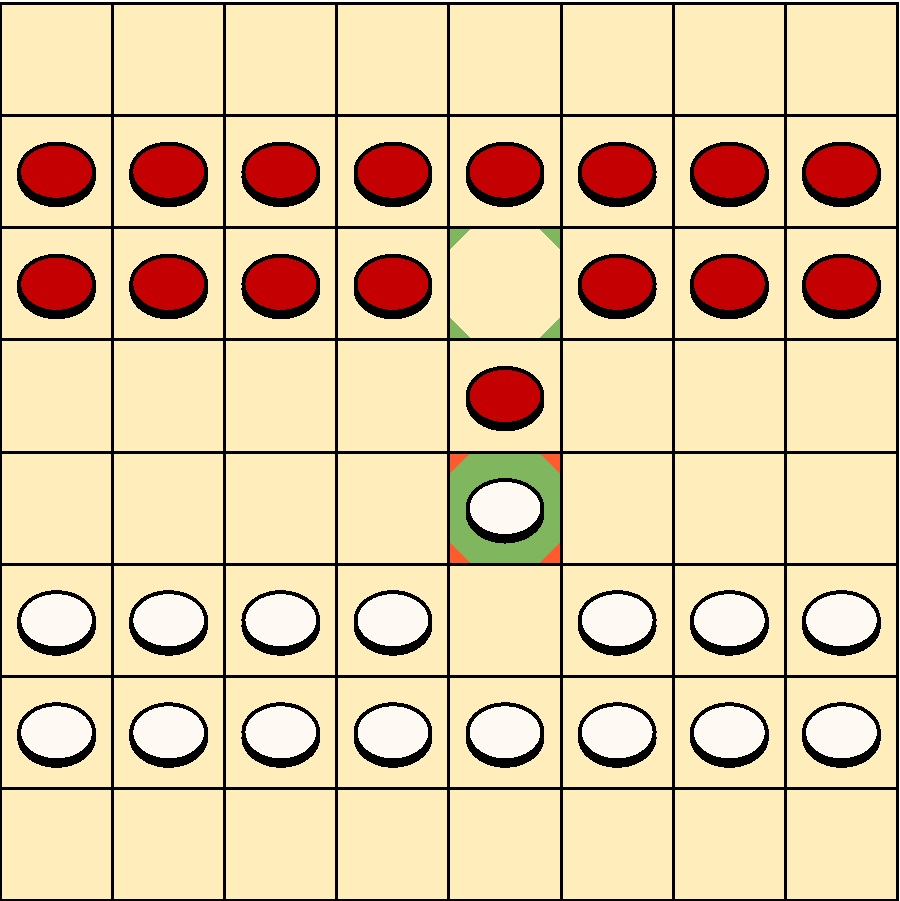
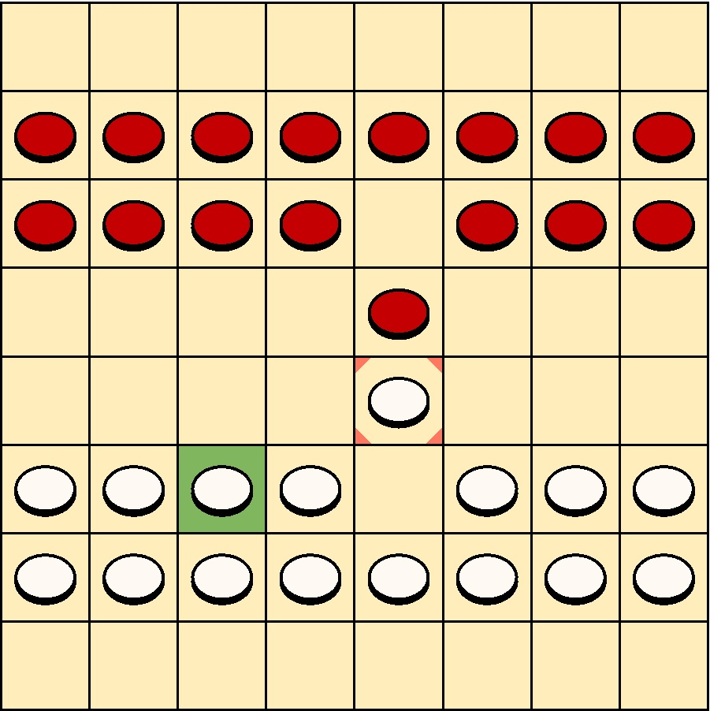
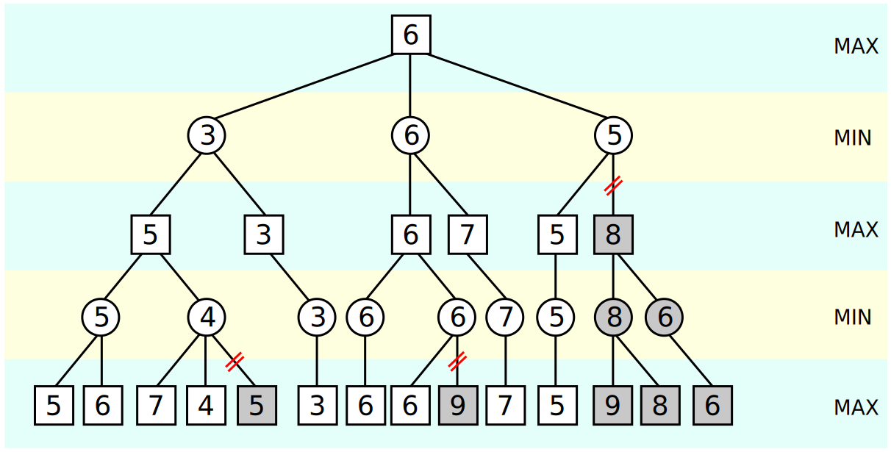
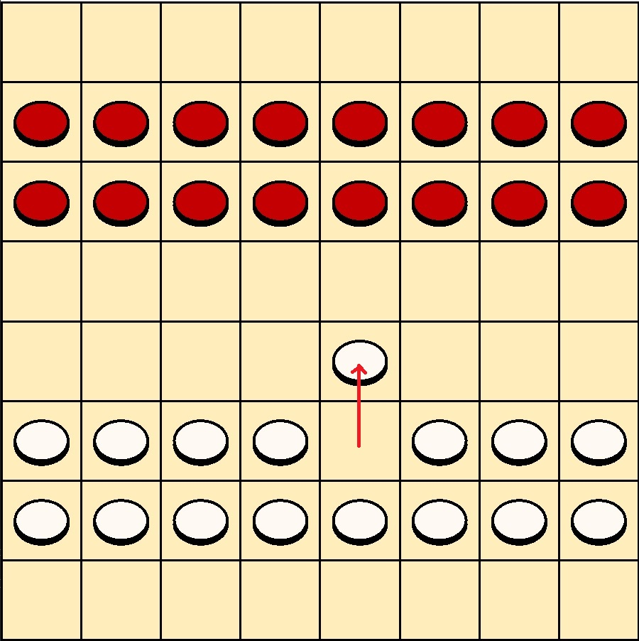
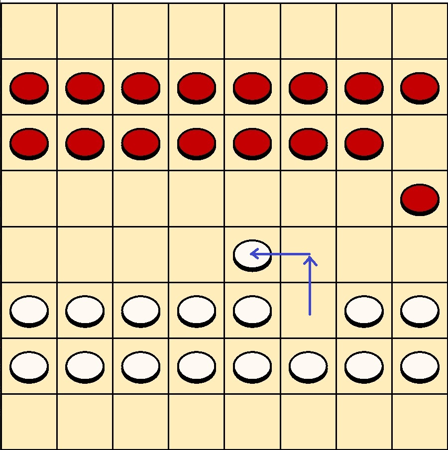

# TurkishDraughts

## Table of Contents
1. [Introduction](#introduction)
2. [Game Rules](#game-rules)
3. [Move Evaluation](#move-evaluation)
4. [Current Optimizations](#current-optimizations)
	1. [Alpha Beta Pruning](#alpha-beta-pruning)
	2. [Transposition Table](#transposition-table)
5. [Future Roadmap](#future-roadmap)

## Introduction

I wanted to write an ai for a board game but seeing that most like chess or checkers have been done before a million times over, I opted for a variant of checkers/draughts known as [Turkish Draughts](https://en.wikipedia.org/wiki/Turkish_draughts). The rules are fairly similar to traditional checkers/draughts with the main difference being pieces move along the axis as opposed to diagonally. This project includes the ai, and a frontend ui, to play the game against it or watch a match between the two ai.

## Game Rules

The game is similar to checkers except the pieces move along the axis. Non kinged pieces are not allowed to move backwards. Kinged pieces are able to move in any amount of moves in any direction.

 | 
:-: | :-: 

Taking pieces is like checkers where pieces jump over each other and need an empty square behind the piece they are attacking, and takes can be chained together. If a piece has the opportunity to take another piece it has to take that piece, if there are multiple combinations of takes you must choose the one that leads to the maximum amount of pieces captured.

*Cant move another piece because a take is possible example...*

 | 
:-: | :-:

A player wins when their opponent either has no pieces remaining, no possible moves, or one kinged piece against a non kinged piece.

## Move Evaluation

Minimax is a recursive tree search that searches every possibility a player has in a given turn repeatedly until a certain depth where it performs a simple evaluation of the outcome. Usually this is done by roughly adding up pieces and their values, and maybe something about their relative positions. It assumes that at every depth in the tree the player playing will always choose the move thats the best for them, and from that works its way up to find the best branch possible.

*By Nuno Nogueira (Nmnogueira) - http://en.wikipedia.org/wiki/Image:Minimax.svg, created in Inkscape by author, CC BY-SA 2.5, https://commons.wikimedia.org/w/index.php?curid=2276653*

While very thorough as its able to look many moves ahead the amount of boards that need to be evaluated increases exponentially with depth. This means that some optimizations and trade offs have to be made to reduce how many branches are searched in order to increase the amount of moves it can search ahead.

## Current Optimizations

There are many ways to optimize the move search each with their own trade offs. For a more comprehensive view of what kind of optimizations are possible a lot of research has been done in regards to [chess engines](https://www.chessprogramming.org/Search). The two main optimizations I have implemented are Alpha Beta Pruning and a Transposition Table.

#### Alpha Beta Pruning

Alpha beta pruning works by not exploring moves of a board when a result has been found that shows the ai would no longer pick this branch in the minmax tree, and thus further exploration is not needed. The result is the same as minimax but it prunes many branches of the tree and their cost would scale exponentially with depth so this results in a substancial performance increase. This approach has almost no downsides, with the added computation time of the alpha beta values being trivially small compared to the actual move search.

*By Nuno Nogueira (Nmnogueira) - https://commons.wikimedia.org/wiki/File:AB_pruning.svg#/media/File:AB_pruning.svg, CC BY-SA 3.0, https://commons.wikimedia.org/w/index.php?curid=3708424*

#### Transposition Table

Transposition tables store all previously explored boards and their values. Since there are multiple ways to reach the same board by refrencing the transposition table instead of re-evaluating that board many branches of the tree don't need to be re-evaluated.

 | 
:-: | :-:

The downside with this approach is simply there are more than 2^64 possible board configurations which means there are more board configurations than the size of addressable memory. As a result if you try to store every explored board you eventually run out of memory, so you have to introduce a hashing function that is intentionally causing collisions, or only store computationally expensive moves ie those above a certain depth. Either way this approach trades memory for computation time, and even with its limitations still provides a substancial performance increase. 

## Future Roadmap

This was my November 2021 project ~~the readme writing was pushed back into December unfortunately~~ , and my first attempt at creating game AI. Really happy with the outcome and I'm sure I'll occasionally be revisiting this to see just how much I can optimize it. Next time I try something like this I'll probably try implementing [Monte Carlo Tree Search](https://en.wikipedia.org/wiki/Monte_Carlo_tree_search) maybe even try applying it to a more complex game.

This project certainly isn't perfect by any means and there are a few things that maybe I'll add if I revisit in future...

#### Mid Game Performance

Around the middle of the game when most pieces are still on the board but they are more spread out is when the ai has to explore the most moves. Though I could create a dynamic system where based on the possible amount of moves the ai scales the depth it searches at to keep move evaluation within a certain time, I'd much rather just introduce optimizations for the underlying issue rather than just hiding it away.

One of the many ways is reducing how far king moves are searched (issue #16). Kings are great for controlling space and putting pressure on the opponent, and have immense power in the endgame. However due to how easy it is to trap a king by offering a take, they tend to be used very conservatively, all the while creating almost as many move possibilities as all the non kinged pieces combined. By limiting the depth king moves are searched at until towards the end of the game you would see a massive performance benefit during the middle of the game when promotions tend to occur.  

#### Long Term Strategy And Aggression

While the AI can see X moves ahead it can't see the broader ramifications of certain openings or piece layouts on its long term gameplay past those X moves. With the current measure of board value I try to remedy this by summing up the piece values but also seeing how close to promotion the non kinged pieces are across the board. This tries to incentivize the ai to gradually push its pieces forward and lead them to promotion and to play more aggressively by pushing each sides pieces together. While this does give it a nicer structure long term, I was mistakenly hoping it would also make it play more agressively by pushing its pieces closer together. Unfortunately it didn't because it valued the pieces furthest up the board and hence closest to the enemy and would avoid trading pieces and playing agressively unless it was sure it had a substancial advantage (issue #12).

#### Various Optimizations And Fixes

There are various major optimizations like (Iterative Deepening)[https://www.chessprogramming.org/Iterative_Deepening] or (Aspiration Windows)[https://www.chessprogramming.org/Aspiration_Windows] that I would like to implement at some point but require either substancial changes or some restructure of the current move search implementation.

In terms of fixes I'm still not super familiar with the Pixel 2D library and the game uses a disproportionately large amount of my CPU and GPU to render a relatively simple board. Its never large enough where its something serious worth investigating (usually 5-15% cpu and gpu utilization) but maybe finding a way to only render frames when theres some sort of input from the player or engine, could eliminate this.

#### Multiplayer and Benchmarks

//Add image of benchmarks